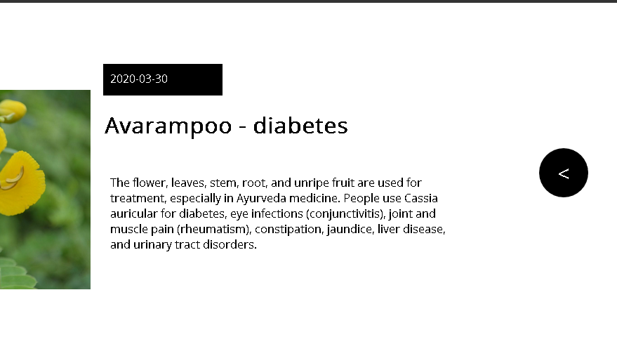

# herbal_repository


A lot of foliages and flowers of plants contain medicine which are left  undiscovered or worse not well categorized. This solution would help in integrating all the available information about the herbal benefits of a plant and provide it to the user in the form of posts . Every logged in user would be able to post information regarding the medicine and tag a plant name. All the posts would be curated with the number of likes and dislikes. There would be a general feed which gets sorted according to number of page visits and number of likes. An user would also be able to make a query about a specific plant and get all posts tagged with that plant.  For logging in every user would have a password The hashed password would be stored in a database.The user will be able to delete or update the post anytime which would be stored in MYSQL database,  php would be used to make connection to database and authentication , the  frontend would be built using javascript,html,css and angular js.  

## Website :

[https://herbalrepository.000webhostapp.com/](https://herbalrepository.000webhostapp.com/)


*   Hosted in 000webhostapp.com
*   Scale.io database provider 

## Explanation :


The first is the home page 
And the second is the side section 
The search box can query results from  any of the plant name or from the heading of the plant
All the posts are displayed in order of date
The popular section provides the top post which is decided based on number of likes - no. of dislikes .The top 5 is posted over there

### Login Page:


It uses angular js form validation techniques 

*   The username cannot be less than 5 characters 
*   The password should minimum have a minimum of 8 characters 
*   Red colour if wrong ,orange if password is medium and green means ok


### Sign up page:


*   Can’t have two users with same username 


### After logging in the login converts to sign out


### Search Result


## Post :


*   Every post contains date posted 
*   A head 
*   A relevant image 
*   At bottom displays no. of views likes and dislikes 
*   One can like the post only if he is logged in 
*   The user who has posted the post can't like or dislike the post 
*   On clicking the head of the post the post expands
*   A back button appears on clicking it reverts to previous form





## Create page


*   A user can see all his posts and modify or delete the post 
*   He can add a new post by clicking the add button on the top 


## Post page:


## Only logged in user can add a like 


### Popular show according to likes - dislikes


## Hashed password 


## Sql commands 


```sql

create table post(id int NOT NULL AUTO_INCREMENT,head varchar(100),url varchar(400),
userid int NOT NULL,date TIMESTAMP DEFAULT CURRENT_TIMESTAMP ON UPDATE CURRENT_TIMESTAMP,
info varchar(1000),plant varchar(30),PRIMARY KEY(id),FOREIGN KEY(userid) REFERENCES 
user(id));


create table user(id int NOT NULL AUTO_INCREMENT PRIMARY KEY,username varchar(20),password 
varchar(255));

create table stats(id int NOT NULL PRIMARY KEY,likes int DEFAULT 0,dislikes int DEFAULT 0,
views int DEFAULT 0,FOREIGN KEY(id) REFERENCES poITEst(id));


```


## Conclusion 

The given website is created using mysql javascript php and angular js 

